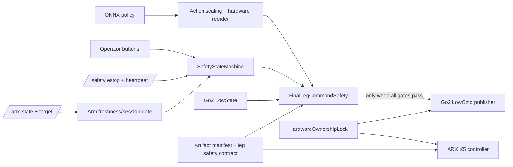

# gx-real Go2-X5 Phase A 最小安全封堵实施记录

文档日期：2026-07-12  
审查及修改基线：`main@264f10cc7c65be5af7f0d88a6db0043113265c97`  
实施状态：`PHASE A COMPLETE — STILL NO-GO FOR HARDWARE`

## 1. 文档目的

本文档稳定记录 gx-real Go2-X5 真机部署仓库 Phase A 最小安全封堵的设计、实现范围、代码证据、测试结果和剩余风险。

本轮目标不是完成整套安全架构重构，也不是给出真机放行结论，而是在保留当前主控制链路的条件下，使已经确认的危险路径 fail-closed：

- 停止、ESTOP、FAULT 和 shutdown 不得主动回 home；
- 停止后不得继续产生或发布站立、policy 或陈旧位置命令；
- arm state/target 必须持续检查新鲜度和 producer generation；
- Go2 最终命令必须经过集中安全门；
- X5 型号和反馈必须在开 gain 前验证；
- Go2、X5 CAN 和夹爪 writer 必须使用统一 cooperative ownership；
- legacy writer 和 vendor 示例不得成为生产可达路径；
- policy、配置、SDK 和动态库必须由受控 manifest 绑定；
- 找不到可信硬件契约时，生产入口必须拒绝启动。

本文档中的“软件 ESTOP”不表示 safety-rated emergency stop，也不替代独立硬件急停、动力切断或现场安全措施。

## 2. 工作树保护与测试边界

修改前固定的 Git 证据为：

```text
branch: main
commit: 264f10cc7c65be5af7f0d88a6db0043113265c97
worktree: dirty
```

修改前已经存在且与本轮重叠的用户逻辑包括：

- `real-wbc/modules/arm_observation.py` 中的 `fixed_initial` observation；
- `real-wbc/modules/wbc_node_leg12_arm_passthrough.py` 对该模式的接入；
- `real-wbc/scripts/run_wbc_leg12.py` 中的 `--arm-observation-mode` CLI。

这些逻辑未被覆盖。`fixed_initial` 仍可用于离线诊断，但生产入口明确拒绝该模式。

本轮未执行：

- 真机启动脚本；
- ROS 2/DDS 真机 publisher；
- `/lowcmd` publisher 实例；
- ARX controller 实例；
- CAN、`can0`、SpaceMouse 或 spnav 初始化；
- Unitree、ARX5 或 CAN 硬件示例；
- `sudo`、`cansend` 或任何物理输出测试。

所有动态验证均限于纯函数、mock/fake、静态 wiring 检查和不接触设备的子进程 flock 测试。

## 3. 总体方案

Phase A 在现有主链路外增加五个集中式安全构件：



集中构件为：

1. `SafetyStateMachine`：唯一输出许可和 latch 权威；
2. `SafetyLeaseMonitor`：WBC safety session、heartbeat 和 publisher lease；
3. `ArmObservationCache` 协议门：state/target freshness、source、session 和 sequence；
4. `FinalLegCommandSafety`：最终 hardware-order Go2 command gate；
5. `HardwareOwnershipLock`：Go2 LowCmd、X5 CAN 和夹爪 cooperative ownership。

## 4. Patch A：纯函数安全层和测试基线

新增：

- `real-wbc/modules/safety_state.py`
- `real-wbc/modules/final_command_safety.py`
- 对应纯单元测试。

状态机至少包含：

```text
BOOT
PREFLIGHT
STANDBY
ALIGNING
ARMED
RL_ACTIVE
STOPPING
ESTOPPED
FAULT
SHUTDOWN
```

核心性质：

- BOOT/PREFLIGHT/STANDBY 默认 `output_enabled=False`；
- 只有显式 ALIGN/ARM 事件可以获得输出许可；
- ESTOP 和 FAULT 本地锁存；
- 消息恢复不能自动进入 ACTIVE；
- ESTOP release、FAULT acknowledge、ALIGN 和 ARM 是不同事件；
- shutdown 幂等且不可恢复。

最终命令安全层的验证顺序包括：

1. shape；
2. floating dtype；
3. finite；
4. hardware joint order；
5. 物理位置上下限；
6. 每周期最大 step；
7. 基于 monotonic dt 的速度限制；
8. 加速度限制；
9. jerk 限制；
10. 当前状态输出许可；
11. command age；
12. source/session；
13. ESTOP/FAULT latch；
14. lowstate freshness。

该模块不包含猜测的 Go2 限位。所有位置、速度、加速度和 jerk 参数必须来自 VERIFIED 合同。

## 5. Patch B：ESTOP 和 shutdown 禁止 home

修改：

- `real-wbc/modules/spacemouse_arm_node.py`
- `real-wbc/modules/wbc_node_leg12_arm_passthrough.py`

Arm Node 的 ESTOP 顺序变为：

```text
锁定本地 safety lock
→ estop_latched=True
→ output_enabled=False
→ arm_position_control_enabled=False
→ 退出临界区
→ 第一次且唯一一次安全硬件调用：set_to_damping()
```

删除内容：

- ESTOP 中的 `reset_to_home()`；
- WBC ESTOP 中的 arm home；
- shutdown 中的 home；
- exception cleanup 中的 home。

双键 home 仍是独立显式操作，但只有输出已由 operator ARM 授权，且不存在 ESTOP/FAULT latch 时才可执行。

## 6. Patch C：显式停止和故障状态机

WBC 原有布尔变量仍作为 policy 内部进度数据保留，但不再拥有硬件输出授权。`SafetyStateMachine` 是 `policy_timer_callback` 和 `motor_timer_callback` 的权威 guard。

R2 流程为：

```text
任意运动状态
→ STOPPING
→ 立即撤销 output permission
→ 清除 start_policy / alignment / pose_test / start_time 等全部运动标志
→ 清零 base teleop target
→ 发布固定 3 条 passive LowCmd
→ STANDBY
→ 必须重新 ALIGN 和 ARM
```

L1 流程为：

```text
任意状态
→ ESTOPPED latch
→ 清除全部运动标志
→ 有界 passive sequence
→ 发布 latched software ESTOP
→ WBC-owned arm 若存在则 damping
```

L1 和 R2 分支完成后立即 return，因此同一 joystick callback 不会继续处理 R1、L2 或其他运动按钮。

Runtime fault 统一进入 FAULT。`safety_stop_reason` 同时成为状态转换依据和诊断字段，不再只是日志文本。

正常退出统一调用 `safe_shutdown()`：

```text
撤销输出许可
→ 清除运动标志
→ 有界 passive sequence
→ arm damping
→ cancel motor/policy/heartbeat timers
→ release ownership locks
→ destroy ROS node
```

该路径解决正常 SIGINT、SIGTERM 和 Python exception cleanup，不声称解决 SIGKILL。

## 7. Patch D：arm state 持续 freshness 与 generation

`ArmState.msg` 和 `ArmTargetState.msg` 新增：

```text
string session_id
uint64 sequence
float64 monotonic_timestamp
```

安全超时以 WBC 本地 callback 接收的 `time.monotonic()` 为权威。消息携带的 monotonic timestamp 仅用于 producer 诊断，避免跨主机或跨进程时钟被错误用作安全时间基准。

缓存拒绝：

- 缺失 source/session/positive sequence；
- sequence 重复；
- sequence 倒退；
- source 改变；
- session 改变，即 producer 重启；
- 无效维度或非有限数据。

在 ALIGNING、ARMED、RL_ACTIVE 中，每次 policy tick 均同时检查：

- `/arm/state` fresh + valid；
- `/arm/target_state` fresh + valid。

任意一条 stale/invalid 都进入 latched FAULT、停止 policy、撤销非 passive LowCmd 输出。消息恢复不会清除 FAULT。

生产入口同时强制：

- `arm_observation_mode=live`；
- `require_arm_state_for_rl=True`；
- `arm_control_owner=external_spacemouse`。

## 8. Patch E：最终 Go2 命令安全层

`FinalLegCommandSafety` 位于以下位置：

```text
ONNX action
→ action scale / target construction
→ policy joint order to hardware joint order
→ FinalLegCommandSafety
→ motor_cmd update
→ CRC
→ /lowcmd publish
```

限制持续生效，不再只依赖 policy 启动前三秒的 action limiter。被限制时只按节流频率记录：

- raw command；
- limited command；
- limit reason；
- 最大修改量。

仓库中没有找到可追溯的 Go2 物理 joint/rate 合同，因此新增：

```text
config/go2_leg_safety_contract.yaml
verification_status: UNVERIFIED
```

在该合同被独立审核并改为 VERIFIED 前，WBC 会在创建 `/lowcmd` publisher 前拒绝启动。这是有意的 fail-closed gate。

## 9. Patch F：X5 型号与 feedback preflight

真机 Arm CLI 和节点只允许精确型号：

```text
X5
```

拒绝 L5、X7、X5_umi 和任意字符串。

受控 SDK artifact 中验证的配置契约为：

```text
robot_model: X5
joint_dof: 6
motor_id: [1, 2, 4, 5, 6, 7]
```

feedback preflight 拒绝：

- feedback 缺失；
- 非有限值；
- 全零 position；
- 错误维度；
- stale timestamp；
- 时间倒退；
- motor count/order 不符；
- SDK model 与 CLI/manifest 不符。

controller 构造后的第一条显式调用为 damping。初始化阶段不再自动调用 position hold 或 set gain。

只有在以下条件同时成立时，本地双键 operator ARM 才可开 position/gain：

- 无 ESTOP/FAULT latch；
- safety lease 健康；
- feedback preflight 再次通过；
- 当前状态允许 ARM。

ARX SDK controller 构造函数内部是否发送 CAN 命令仍为 UNKNOWN，不能由 Python mock 关闭。

## 10. Patch G：统一 hardware ownership

资源名称固定为：

```text
go2-lowcmd
x5-can
x5-gripper
```

默认目录：

```text
/run/lock/gx-real
```

真机模式拒绝：

- `/tmp`；
- `/var/tmp`；
- 仓库内部目录；
- 非 `/run/lock` 或 `/var/lock` 的路径。

每个 lock metadata 包含：

- resource；
- owner；
- pid；
- uid；
- hostname；
- boot id；
- process start time；
- lock path；
- filesystem device；
- inode；
- wall-clock acquisition time。

`GX_REAL_LOCK_DIR_DEV_INO` 用于比较 host/container lock directory 的 `dev:ino`。不一致时拒绝启动，防止同名不同 inode 的锁造成双 writer。

锁顺序：

- WBC 在创建 `/lowcmd` publisher 前获取 `go2-lowcmd`；
- Arm Node 在构造 ARX controller 前同时获取 `x5-can` 和 `x5-gripper`；
- 锁覆盖 publisher/controller 的整个生命周期；
- 正常退出显式释放；
- SIGKILL 时依赖内核释放 flock。

文件锁只能约束合作进程，不能阻止仓库外 DDS 或 CAN writer。

## 11. Patch H：legacy 和 vendor writer 阻断

`real-wbc/scripts/run_wbc.py` 的 legacy 18D whole-body writer 在 `rclpy.init()` 前检查：

```text
--offline-legacy-only
GX_REAL_HARDWARE_MODE=offline
```

两项缺一即退出。生产模式不可达。

`scripts/run_arm_spacemouse_test.sh` 原本直接启动无统一锁的 vendor SpaceMouse CAN teleop，且默认型号为 X5_umi；现已在脚本开头硬阻断。

Unitree 和 ARX5 CMake 增加：

```text
GX_REAL_BUILD_VENDOR_HARDWARE_EXAMPLES=OFF
```

生产默认不构建或安装硬件 writer 示例。

新增 writer inventory CI，搜索：

- LowCmd publisher；
- ARX controller 构造；
- `cansend`；
- joint/eef command send。

每个候选 writer 必须在 allowlist 中被标记为：

- guarded production writer；
- blocked legacy writer；
- excluded vendor example；
- vendor library internal；
- mock-only test。

当前结果为：

```text
hardware writer inventory: 32 candidate files, all classified
```

## 12. Patch I：受控 artifact manifest

新增 `config/artifact_manifest.yaml`，绑定：

- Git commit；
- dirty worktree policy；
- policy 路径和 SHA-256；
- env.yaml 路径和 SHA-256；
- 260D observation shape；
- 12D action shape；
- 精确 Go2 joint order；
- 精确 X5 model；
- Unitree SDK snapshot；
- ARX5 SDK snapshot；
- crc、ARX hardware、solver 等关键 `.so` SHA-256；
- Python version；
- ONNX Runtime version；
- RMW implementation；
- CycloneDDS config SHA-256；
- Go2 leg safety contract SHA-256。

运行时 policy 路径必须与 manifest 绑定路径完全一致，不能通过 CLI 加载另一份同 shape policy。

当前状态：

```text
release_status: UNRELEASED
onnxruntime_version: UNRESOLVED
dirty_worktree_policy: REJECT
```

因此生产启动当前必然 fail-closed。

## 13. Patch J：回归测试与文档

修改前测试：

```text
67 passed, 1 failed, 1 skipped
```

原失败为 joystick Y-inhibit 测试把可配置的 vx 方向假设混入 inhibit 行为验证。默认 `vx_sign=+1` 时 `ly=-0.5` 合法映射为负 vx。测试改为验证非零幅值，没有修改实际控制符号。

修改后测试：

```text
146 passed, 1 skipped
```

唯一 skip：

```text
tests/test_policy_height_scan_contract.py
reason: No module named 'onnxruntime'
```

新增测试覆盖：

- ESTOP 不调用 home；
- ESTOP 第一条硬件调用为 damping；
- ESTOP 后 target/home/gripper 被拒绝；
- 重复 ESTOP 和 shutdown 幂等；
- FAULT/ESTOP 消息恢复不自动 ACTIVE；
- 任意状态 L1 优先；
- R2 清除 stand flag 且只走 passive path；
- arm freshness 0.25 秒边界；
- state/target 独立 stale；
- sequence 重复、倒退和 producer restart；
- NaN、Inf、±100 action、错误 dtype/shape/order；
- step、velocity、acceleration、jerk 和 dt 边界；
- X5 型号、feedback、motor count/order；
- 双 writer 互斥；
- 正常释放和 SIGKILL 后 flock 释放；
- host/container dev:ino mismatch；
- manifest hash、dirty、runtime version、model 和缺字段；
- legacy/vendor writer inventory；
- QoS 和 heartbeat wiring。

ONNX exception 以及单次 inference 超出 policy 周期会进入 latched FAULT。若 ONNX/executor 永久不返回，同进程 timer 无法自救，仍需独立进程 watchdog。

## 14. 代码证据索引

| 安全不变量 | 代码证据 |
| --- | --- |
| Arm ESTOP 先锁存、后 damping、无 home | `real-wbc/modules/spacemouse_arm_node.py:409-422` |
| Arm shutdown 无 home 且幂等 | `real-wbc/modules/spacemouse_arm_node.py:1002-1021` |
| WBC R2 集中 passive stop | `real-wbc/modules/wbc_node_leg12_arm_passthrough.py:1406-1424` |
| L1/R2 callback 后立即 return | `real-wbc/modules/wbc_node_leg12_arm_passthrough.py:2846-2864` |
| arm state/target 持续 freshness | `real-wbc/modules/wbc_node_leg12_arm_passthrough.py:2724-2741` |
| 最终命令门位于 publish 前 | `real-wbc/modules/wbc_node_leg12_arm_passthrough.py:3141-3198` |
| X5 型号和 feedback preflight | `real-wbc/modules/x5_preflight.py:25-56` |
| Operator ARM 才允许 gain | `real-wbc/modules/spacemouse_arm_node.py:670-688` |
| Go2 lock 在 publisher 前获取 | `real-wbc/modules/wbc_node_leg12_arm_passthrough.py:396-407` |
| X5 locks 在 controller 前获取 | `real-wbc/modules/spacemouse_arm_node.py:262-281` |
| false ESTOP 不解除 latch | `real-wbc/modules/spacemouse_arm_node.py:382-385` |
| ESTOP/FAULT 显式 operator release | `real-wbc/modules/safety_state.py:151-168` |
| legacy 18D 生产阻断 | `real-wbc/scripts/run_wbc.py:94-105` |
| artifact release gate | `real-wbc/modules/artifact_manifest.py:64-124` |
| Go2 limit VERIFIED gate | `real-wbc/modules/final_command_safety.py:204-230` |

## 15. 当前未关闭风险

以下项目继续保持 OPEN 或 UNKNOWN：

1. WBC 被 SIGKILL、主机故障或 executor 永久卡死后，Go2 receiver 如何处理最后一条 LowCmd；
2. Arm Node 被 SIGKILL 后，X5 驱动器内部 watchdog、gain 和最后命令保持行为；
3. ARX controller 构造函数内部是否在 feedback preflight 前发送 CAN 命令；
4. CAN bus-off、error-passive 和接口恢复后的强制重新 arm；
5. 外部非合作 DDS `/lowcmd` publisher；
6. 外部非合作 CAN writer；
7. ROS 2 message rebuild 后的真实 QoS、late joiner、publisher-loss 和 session restart；
8. ONNX/executor 永久阻塞；
9. 独立硬件急停或动力切断；
10. Go2 可信物理 position/rate/acceleration/jerk 合同；
11. ONNX Runtime 生产版本与实际推理延迟；
12. 物理输出禁用条件下的通信联调和 fault injection。

## 16. 后续放行 Gate

在考虑任何真机输出前，至少必须完成：

```text
FAIL  artifact_manifest.yaml 尚未 RELEASED
FAIL  go2_leg_safety_contract.yaml 尚未 VERIFIED
FAIL  ONNX Runtime 版本与 inference latency 尚未验证
FAIL  ROS messages 尚未重建并完成 DDS safety session 联调
FAIL  Go2 receiver watchdog 行为 UNKNOWN
FAIL  X5 process-death 行为 UNKNOWN
FAIL  CAN bus-off/recovery 行为未验证
FAIL  独立硬件 ESTOP/动力切断未验证
```

建议后续顺序：

1. 在干净 release worktree 生成并独立复核 manifest；
2. 从可追溯 Go2 硬件契约填充最终命令限位；
3. L0 继续运行纯测试和 writer inventory；
4. L1 使用 fake Unitree publisher、fake ARX controller、fake SpaceMouse 和可控 monotonic clock 做 fault injection；
5. L2 在物理动力禁用条件下验证 DDS、heartbeat、late joiner、process death 和 CAN 状态机；
6. 取得 receiver/driver watchdog 证据后，再制定低能量受控真机测试计划。

## 17. 最终结论

```text
PHASE A COMPLETE — STILL NO-GO FOR HARDWARE
```

Phase A 完成表示已实施软件侧最小封堵和 fail-closed gate，不表示真机安全已被证明，也不表示系统满足任何安全认证。
