# gx-real Go2-X5 真机部署安全与稳定性审查报告

审查日期：2026-07-12  
审查方式：代码与仓库证据只读审查；未启动 ROS 2/DDS、Unitree、ARX5、CAN 或 SpaceMouse 真机程序  
审查对象：审查时工作树实际内容  
基线：`main@264f10cc7c65be5af7f0d88a6db0043113265c97`

> 本报告中的 L1、`/safety/estop` 等均属于软件停止或软件急停机制，不是 safety-rated emergency stop，也不能替代独立硬件急停、接触器或动力切断。

## 1. 执行结论

结论：`NO-GO`

- 当前允许连接真机：`NO`
- 当前允许发送 Go2 low-level command：`NO`
- 当前允许发送 X5 CAN command：`NO`
- 未关闭 P0：有
- 未关闭 P1：有

最危险的三个问题：

1. L1 软件急停会主动命令 X5 回零，然后才进入阻尼。独立 Arm Node 与 WBC legacy arm 路径都存在该行为；这不是可靠停止。
2. Go2 LowCmd 和 X5 CAN 都无法证明单 writer。仓库中存在可直接运行的 legacy WBC、Unitree 示例和 ARX5 示例；Go2 无进程锁，X5 锁没有覆盖 legacy/example，且容器与宿主机默认不共享锁 inode。
3. 停止与故障后的硬件安全状态没有可靠上界。R2 在 internal stand 路径中仍可能持续发布站立位置命令；WBC 异常退出/SIGKILL 后仅停止发送，Go2 接收端行为为 `UNKNOWN`；ARX5 无上层命令、状态或 CAN bus-off watchdog。

主要 P0：

- 多个 Go2 LowCmd writer 可同时运行。
- 多个 X5/夹爪 writer 可绕过锁。
- L1 和 shutdown 路径会让 X5 运动到 home。
- `/safety/estop` 是 volatile 的一次性软件事件，晚启动或断网时可能永久丢失。
- R2 不能证明停止 LowCmd，正常退出也不主动发 passive LowCmd。
- `/arm/state` 超时后 WBC 仍使用旧状态参与 policy。
- 策略动作在启动 3 秒后无物理关节位置或变化率约束。
- Arm Node 允许通过参数选择 L5/X7 等错误型号。
- ARX5 缺少反馈时默认仍可继续初始化并发送 position hold。
- ONNX 异常或卡死没有独立 watchdog 和 fail-safe executor。

仍为 `UNKNOWN`：

- 真机 Go2 固件、SDK2、IDL 的精确版本兼容矩阵。
- Go2 在 LowCmd writer 消失后多久进入何种硬件状态。
- ARX5 电机驱动器在 CAN 消失后是否及何时自行失能。
- 当前 Jetson 上实际 ROS、RMW、Python、ONNX Runtime、ARX5 `.so` ABI。
- 实际网络拓扑、接口 IP、DDS 可发现主机范围和 `ROS_DOMAIN_ID`。
- 部署时宿主机与容器是否共享同一个 CAN 锁文件 inode。
- 现场是否存在独立硬件急停、动力切断和接触器。
- 当前 `policy.onnx` 的实际 I/O shape；离线测试因系统 Python 缺少 `onnxruntime` 被跳过。
- CAN backend 预编译 `.so` 的 bus-off/写失败具体行为。
- 是否有仓库外 supervisor/systemd 自动重启节点。

## 2. 仓库与依赖快照

| 项目 | 结果 |
|---|---|
| 仓库 | `/home/lemon/research/Issac/gx-real` |
| branch | `main` |
| commit | `264f10cc7c65be5af7f0d88a6db0043113265c97` |
| dirty state | 是：审查开始时存在 tracked 修改、tracked 删除和未跟踪文件 |
| submodule | 无 |
| 仓库外软链接 | 未发现；两个软链接均在 `real-wbc/ros2/log/` 内 |
| 未跟踪真机启动脚本 | 未发现 |
| policy | `policies/policy.onnx`，未纳入 Git，被 `.gitignore` 隐藏 |
| policy SHA-256 | `4aeaa56e48b38e3fd20436205a4aa286039b9fcc86dc2bab4a647dfb95762063` |
| policy.pt SHA-256 | `02935c2d03aa3a058cf63b7cadb0723c319588363503e374155014ba2bf6ac05` |
| config | `policies/env.yaml`，纳入 Git |
| env SHA-256 | `bdd88ccbf71d862b72183d70fa6fabdc64a5b270c42c7fb37295e463b7bb2462` |
| model/config manifest | 不存在 |
| ROS 目标版本 | 脚本优先 Foxy、否则 Humble；审查机只有 Humble |
| 当前审查机 | Ubuntu 22.04/x86_64，kernel 6.8；不是真机 Jetson |
| RMW | 脚本期望 `rmw_cyclonedds_cpp`；目标机实际值 `UNKNOWN` |
| CycloneDDS | Unitree 文档称 0.10.2；部署实际库版本 `UNKNOWN` |
| ROS_DOMAIN_ID | 未设置、未验证 |
| Unitree ROS2 | vendor copy，`version.txt=0.3.0`；不是 submodule |
| Unitree SDK2 | vendor copy；README 仅称 modified SDK2，无上游 commit manifest |
| ARX5 SDK | vendor copy；Python 包版本 `0.1.2`；不是 submodule |
| Python | 启动脚本默认 `/usr/bin/python3`；审查机为 3.10.12；shell `python3` 是 Conda 3.13.5 |
| ONNX Runtime | 系统 Python 未安装，版本 `UNKNOWN` |
| 容器 | Humble/L4T r36.2.0 Dockerfile；host network；无共享 CAN lock mount |
| 宿主/容器锁 | `UNKNOWN/FAIL`：默认容器 `/tmp` 不共享 inode |
| 动态库 | ARX5 aarch64/x86_64 `.so`、Unitree CRC `.so` 均纳入 Git，但无源代码-二进制 build manifest |

`.gitignore` 的关键影响见：

```text
.gitignore:1-7
```

- `policies/*` 仅放行 `env.yaml`。
- ONNX、PT、height-scan contract 均不可由 commit 唯一还原。
- `logs/`、ROS build/install、SDK build 输出也被忽略。

离线测试结果：

```text
67 passed, 1 failed, 1 skipped
```

- 失败：`tests/test_base_command_provider.py:74-85` 对默认 joystick 符号的期望与实现相反。
- 跳过：`tests/test_policy_height_scan_contract.py:52-64`，因为 `/usr/bin/python3` 无 `onnxruntime`。
- 测试使用 `PYTHONDONTWRITEBYTECODE=1` 并禁用 pytest cache，测试前后未产生额外仓库修改。

## 3. 系统架构图

主入口描述基本成立：

```text
scripts/run_leg12_real.sh
→ scripts/setup_env.sh
→ real-wbc/scripts/run_wbc_leg12.py
→ WBCNodeLeg12ArmPassthrough
→ policy.onnx + 同目录 env.yaml
```

但 WBC 类名中的 `arm_passthrough` 不代表绝对只读：传入 `--arm-control-owner=wbc` 后，它会直接初始化 ARX5 controller 并发送机械臂和夹爪命令。

```mermaid
flowchart TB
    OP[Go2 Wireless Controller<br/>L1/R1/L2/R2/Y]
    SMHW[3D SpaceMouse]
    SPNAV[spacenavd / libspnav]
    SMP[SpaceMouse reader process<br/>200 Hz]
    SHM[Shared-memory ring buffer]
    ARM[spacemouse_arm_node<br/>50 Hz]
    ARX[ARX5 Cartesian Controller<br/>background 500 Hz]
    CAN[(can0)]
    X5[X5 + Gripper]

    RUN[scripts/run_leg12_real.sh]
    ENV[setup_env.sh<br/>CycloneDDS iface]
    WBC[deploy_node / WBC<br/>policy 50 Hz<br/>LowCmd 500 Hz]
    ONNX[policy.onnx + env.yaml]
    GO2DDS[ROS 2 / CycloneDDS<br/>lowstate lowcmd wirelesscontroller]
    GO2[Unitree Go2]

    ESTOP[/safety/estop<br/>Bool, reliable/volatile]
    AS[/arm/state<br/>50 Hz]
    AT[/arm/target_state<br/>50 Hz]

    LEGACY1[legacy run_wbc.py<br/>18D whole-body writer]
    LEGACY2[Unitree low-level examples<br/>ROS + SDK2 native writers]
    LEGACY3[ARX5 examples/ZMQ/teleop<br/>unlocked writers]
    LOCK[/tmp/gx-real-can-locks/can0.lock]

    RUN --> ENV --> WBC
    ONNX --> WBC
    OP -->|wirelesscontroller| GO2DDS
    GO2DDS -->|lowstate/sport state| WBC
    WBC -->|LowCmd 500 Hz| GO2DDS --> GO2

    SMHW --> SPNAV --> SMP --> SHM --> ARM
    ARM --> ARX --> CAN --> X5
    ARM --> AS
    ARM --> AT
    AS -->|state read| WBC
    AT -->|target read| WBC

    OP -->|L1 callback| WBC
    WBC -->|5 x true| ESTOP --> ARM
    ARM -->|reset_to_home then damping| ARX

    ARM -. flock .-> LOCK
    WBC -. only when arm-control-owner=wbc .-> LOCK
    WBC -. legacy reachable X5 write .-> ARX

    LEGACY1 -. /lowcmd + CAN .-> GO2DDS
    LEGACY1 -. CAN .-> X5
    LEGACY2 -. lowcmd / rt/lowcmd .-> GO2
    LEGACY3 -. CAN without common lock .-> X5

    classDef hardware fill:#fee,stroke:#b00,stroke-width:2px;
    classDef state fill:#eef,stroke:#36c;
    classDef safety fill:#fff3cd,stroke:#b8860b,stroke-width:2px;
    classDef legacy fill:#eee,stroke:#666,stroke-dasharray:5 5;
    class GO2,X5,CAN hardware;
    class AS,AT,GO2DDS state;
    class ESTOP,LOCK safety;
    class LEGACY1,LEGACY2,LEGACY3 legacy;
```

### 3.1 组件清单

| 类别 | 组件 |
|---|---|
| 主 Python 进程 | `run_wbc_leg12.py`、`run_spacemouse_arm.py` |
| 其他 ROS Python 进程 | `run_teleop.py`、`run_pose_estimator.py`、`run_mocap_node.py`、height-scan monitor/snapshot |
| legacy writer | `run_wbc.py` + `wbc_node.py` |
| ARX5 Python writer | SpaceMouse/keyboard teleop、joint/cartesian waypoint、teach/replay、ZMQ server、测试程序 |
| Unitree ROS2 C++ writer | `low_level_ctrl`、`go2_stand_example`、B2/G1 low-level examples |
| Unitree SDK2 native writer | `low_level`、`stand_example_go2`、其他 low-level examples |
| ROS node | `deploy_node`、`spacemouse_arm_node`、`teleop_node`、`pose_estimator_node`、`mocap_node`、`height_scan_monitor` |
| services/actions | 主 WBC/Arm Node 无自定义 service/action；Unitree sport request 使用 `/api/sport/request` topic |
| Unitree participant | WBC 使用 ROS 2 RMW；`disable_sports_mode_go2` 为独立 SDK2 进程 |
| CAN controller | `Arx5CartesianController`；legacy 可用 `Arx5JointController` |
| 共享内存 | `Spacemouse` 子进程 → `SharedMemoryRingBuffer` → Arm Node |
| 后台线程 | ARX5 500 Hz C++ send/recv；SpaceMouse独立进程；mocap/NatNet线程 |
| watchdog | lowstate 0.25 s；sport state 0.5 s；joystick 0.25 s；SpaceMouse sample 0.25 s；arm state仅标记stale |
| lock | X5 intended writer使用`flock`；Go2无锁；legacy/example多数无锁 |
| signal handler | 未发现项目自定义SIGINT/SIGTERM/SIGHUP handler |
| 设备 | `/var/run/spnav.sock`、USB HID、USB serial、`can0` |
| 网络 | 默认`eth0`；CycloneDDS multicast default；ROS domain未固定 |

### 3.2 简化威胁边界

- 使用 host network、multicast default、无 SROS2/认证。机器人局域网中可发现该 DDS domain 的主机原则上可发布 `/lowcmd`、`/arm/state`、teleop topic 或伪造状态。
- `ROS_DOMAIN_ID` 即使设置也只是隔离，不是认证。
- Unitree native DDS 和 ROS 2 DDS 均可能位于 domain 0/同一接口。
- `PYTHONPATH` 和 `LD_LIBRARY_PATH` 从仓库目录优先加载；工作树或环境变量可替换模块和动态库。
- policy 未纳入 Git，无签名、hash manifest 或启动时 allowlist 验证。
- 最小建议是机器人专用物理/VLAN网络、固定CycloneDDS peers/interface、禁止非实验主机接入。SROS2可作为后续防护，但不能替代当前P0修复。

## 4. 控制权矩阵

| 资源 | 允许写入者 | 实际可达写入者 | 读取者 | 互斥机制 | 超时机制 | 急停机制 | 结论 |
|---|---|---|---|---|---|---|---|
| Go2 LowCmd | WBC only | leg12 WBC；legacy WBC；ROS2 low-level examples；SDK2 native examples | Go2 | 无；仅preflight `pgrep` | WBC检查lowstate 0.25 s；Go2接收端`UNKNOWN` | L1退出、runtime fault发一次passive | `FAIL` |
| X5 joint command | SpaceMouse Arm only | Arm Node；WBC `arm-control-owner=wbc`；legacy WBC；ARX examples/ZMQ | ARX motor controller | intended writer使用flock；其他writer不使用 | 无command/state/CAN watchdog | 软件estop回零后阻尼 | `FAIL` |
| X5 Cartesian command | SpaceMouse Arm only | Arm Node；ARX teleop/examples；WBC legacy teleop路径 | ARX controller | 同上 | SpaceMouse sample watchdog仅hold | 回零后阻尼 | `FAIL` |
| Gripper command | SpaceMouse Arm only | Arm Node；WBC legacy；ARX examples/ZMQ | X5 gripper | 同上 | 输入超时部分覆盖；CAN无覆盖 | 回零/阻尼，实际夹爪行为`UNKNOWN` | `FAIL` |
| Base velocity command | 指定输入路径 | fixed、wireless joystick、legacy SpaceMouse teleop | policy observation | 无source-owner lock | joystick 0.25 s；legacy teleop 0.25 s | Y归零；L1退出 | `FAIL` |
| `/safety/estop` | 指定安全输入 | WBC true publisher；任意DDS participant | Arm Node | 无认证/owner | 无deadline/liveliness | Arm Node本地bool latch | `FAIL` |
| `/arm/state` | Arm Node | Arm Node、dry-run/重复节点、任意DDS participant | WBC | 无publisher ownership | WBC标记0.25 s stale但继续运行 | 无 | `FAIL` |
| `/arm/target_state` | Arm Node | 同上 | WBC | 无 | 0.25 s后回退到最后state | 无 | `FAIL` |

关键证据：

```text
real-wbc/modules/wbc_node_leg12_arm_passthrough.py:738-862
real-wbc/modules/wbc_node_leg12_arm_passthrough.py:1193-1258
real-wbc/modules/wbc_node.py:187-269
unitree_ros2/example/src/CMakeLists.txt:42-54
unitree_ros2/example/src/src/go2/go2_stand_example.cpp:67-99
unitree_sdk2/CMakeLists.txt:15-18
arx5-sdk/python/examples/spacemouse_teleop.py:128-186
```

## 5. 状态机

代码没有单一显式状态枚举，而是由 `start_time`、`start_policy`、`align_to_policy_active`、`pose_test_active`、`awaiting_unitree_stand` 等布尔值组合形成隐式状态机。

```mermaid
stateDiagram-v2
    [*] --> BOOT
    BOOT --> STANDBY: model load + CPU warm-up + ROS entities
    STANDBY --> UNITREE_STAND: R1 / Unitree mode
    STANDBY --> INTERNAL_STAND: R1 / internal mode
    STANDBY --> ALIGNING: L2 / manual mode + guards
    UNITREE_STAND --> ALIGNING: L2 after sport completion
    INTERNAL_STAND --> ALIGNING: L2 after elapsed time
    ALIGNING --> RL_ACTIVE: auto after duration + tracking error guard
    RL_ACTIVE --> INTERNAL_HOLD: R2, start_policy=false but start_time retained
    INTERNAL_HOLD --> ALIGNING: L2
    RL_ACTIVE --> RL_ACTIVE: Y only zeros/ramp base command
    RL_ACTIVE --> SOFT_FAULT: lowstate/NaN RuntimeSafetyFault
    ALIGNING --> SOFT_FAULT: watchdog failure
    SOFT_FAULT --> ALIGNING: later R1/L2; safety_stop_reason is not a guard
    STANDBY --> PROCESS_EXIT: L1
    RL_ACTIVE --> PROCESS_EXIT: L1
    PROCESS_EXIT --> [*]

    state "Arm Node" as ARM {
        [*] --> INIT_HOLD
        INIT_HOLD --> ACTIVE: current pose hold enabled
        ACTIVE --> HOLD: SpaceMouse sample stale
        HOLD --> ACTIVE: fresh sample automatically returns
        ACTIVE --> ESTOPPED: /safety/estop=true
        ESTOPPED --> HOME_MOTION: reset_to_home
        HOME_MOTION --> DAMPING
        DAMPING --> [*]: process shutdown
    }
```



危险转换：

- `L1 → reset_to_home → damping`：急停入口先产生机械臂运动。
- `RL_ACTIVE → R2 → INTERNAL_HOLD`：没有清除`start_time`，仍可继续生成站立目标并发布LowCmd。
- `SOFT_FAULT → R1/L2`：`safety_stop_reason`不参与重新arm guard；没有独立fault acknowledge/reset。
- `SpaceMouse stale → HOLD → ACTIVE`：消息恢复后自动恢复输入接受，没有重新arm状态。
- Arm Node restart：`estopped=False`，随后立即position hold，急停锁存不跨进程。
- WBC exception/SIGTERM：`finally`不发送passive LowCmd。

## 6. 关键数据链路

### 6.1 260D observation → Go2 LowCmd

| 段 | slice | 来源 |
|---|---:|---|
| base linear velocity | 0:3 | lowstate tick + IMU + foot contact + joint kinematics |
| base angular velocity | 3:6 | IMU gyroscope，10-sample filter |
| projected gravity | 6:9 | IMU quaternion |
| base commands | 9:12 | fixed / wireless joystick / legacy teleop |
| joint position | 12:30 | 12 leg + 6 arm |
| joint velocity | 30:48 | 12 leg + 6 arm |
| last action padded | 48:66 | 12 leg action + 6 zeros |
| height scan | 66:253 | 187D，默认全零或lidar provider |
| arm target | 253:259 | `/arm/target_state`或fallback |
| gripper target | 259:260 | `/arm/target_state`或fallback |

数据行为：

- lowstate callback使用接收端`time.monotonic()`更新freshness。
- lowstate自带`tick`，但未检查重复、倒退、跳变或wrap。
- ROS callback与policy timer运行在默认单线程executor，当前WBC内部大部分共享状态不会并发撕裂。
- policy目标频率为`1/(0.0025×8)=50 Hz`。
- ONNX provider硬编码为CPU；构造时warm-up 1+50次。
- 输出必须为12D且finite。
- 输出依次经过：config clip → 启动3 s abs/delta limit → sim2sim delay/hold → scale/offset → handover blend → hardware joint reorder。
- 3秒后没有物理关节限位或持续rate limit。
- 500 Hz motor timer计算CRC并发布`/lowcmd`。
- lowstate超过0.25 s时发一次passive LowCmd；若executor被ONNX、日志或回调阻塞，上界失效。

证据：

```text
real-wbc/modules/wbc_node_leg12_arm_passthrough.py:2808-2961
real-wbc/modules/wbc_node_leg12_arm_passthrough.py:2998-3055
real-wbc/modules/wbc_node_leg12_arm_passthrough.py:3162-3654
real-wbc/modules/wbc_node_leg12_arm_passthrough.py:3672-3894
policies/env.yaml:423-647
policies/env.yaml:852-880
```

### 6.2 SpaceMouse → X5 CAN

```text
SpaceMouse
→ spacenavd/libspnav
→ Spacemouse child process 200 Hz
→ atomic-counter shared-memory ring
→ Arm Node timer 50 Hz
→ explicit axes/sign/deadzone/scale
→ EEF target
→ ARX5 CartesianController
→ C++ background send/recv 500 Hz
→ can0
→ X5 + gripper
```

- `receive_timestamp`、`motion_timestamp`使用monotonic。
- 新motion必须有变化后的sequence；启动时必须先回到中位。
- producer在无事件时持续写零motion heartbeat，因此不会重放最后非零motion。
- daemon存活而设备断开也表现为持续零heartbeat；设备断连不会触发watchdog。
- Arm Node只限制每次SpaceMouse增量，ARX SDK执行关节位置、速度和力矩裁剪。
- 无CAN health、bus-off、feedback age或command age检查。
- watchdog超时进入position hold，而不是阻尼；恢复样本后自动解除watchdog状态。

### 6.3 L1 → 所有硬件 writer

```text
WirelessController callback
→ WBC emergency_stop()
→ publish /safety/estop=true 5次，20 ms间隔
→ Arm Node subscriber
→ reset_to_home()
→ sleep 0.7 s
→ set_to_damping()
```

同时WBC自身：

```text
L1
→ optional WBC-owned X5 reset_to_home/damping
→ exit(0)
```

缺陷：

- WBC没有先发送passive Go2 LowCmd。
- `/safety/estop`为reliable/volatile，无transient-local durability。
- Arm subscriber未启动或DDS中断时，事件不会持久保存。
- 这是软件急停；仓库中没有独立硬件急停或动力切断证据。

### 6.4 arm state → WBC observation

- Arm Node 50 Hz发布header stamp。
- WBC忽略源header stamp，以回调接收时的monotonic时间为freshness。
- 0.25 s后`state_fresh=False`，但`ArmObservationCache.get()`仍返回最后一次`state_valid`的关节位置、速度和力矩。
- `--require-arm-state-for-rl`只约束进入RL的瞬间；默认值为`False`，进入RL后也不持续约束。
- state与target是两个独立topic，不能形成跨topic原子快照。

### 6.5 joystick → base command

- `/wirelesscontroller`无source timestamp/sequence。
- WBC按接收monotonic时间刷新。
- 超过0.25 s后raw command变为零。
- 零命令仍经过加速度限制；默认最大速度下，停止到零最坏约：vx 1.67 s、vy 0.67 s、yaw 0.83 s。
- joystick恢复后会自动继续接受输入，没有重新arm。
- L1也来自同一无线topic，因此手柄断连时软件急停入口同时消失。

### 6.6 关键 topic QoS

下列项目均使用整数depth构造默认QoS，即`KEEP_LAST + RELIABLE + VOLATILE`；没有deadline、lifespan、liveliness lease或transient-local durability。

| Topic | Type | Publisher | Subscriber | 频率 | depth | 源时间 | 最大年龄 | 超时行为 |
|---|---|---|---|---:|---:|---|---:|---|
| `/lowcmd` | `unitree_go/LowCmd` | WBC及legacy/example | Go2 | 500 Hz | 1/10 | 无 | receiver `UNKNOWN` | sender侧lowstate stale后passive一次 |
| `/lowstate` | `unitree_go/LowState` | Go2 | WBC | `UNKNOWN` | 1 | tick | 0.25 s receipt age | passive一次 + policy false |
| `/wirelesscontroller` | `WirelessController` | Go2 | WBC | `UNKNOWN` | 1 | 无 | 0.25 s | base目标归零，L1不可用 |
| `/lf/sportmodestate` | `SportModeState` | Go2 | WBC | `UNKNOWN` | 1 | TimeSpec但代码忽略 | 0.5 s | 拒绝/停止low-level |
| `/safety/estop` | `std_msgs/Bool` | WBC | Arm Node | event ×5 | 1/10 | 无 | 无 | true本地锁存；丢失则无动作 |
| `/arm/state` | `ArmState` | Arm Node | WBC | 50 Hz | 10/1 | Header，WBC忽略 | 0.25 s | 仅警告，继续旧状态 |
| `/arm/target_state` | `ArmTargetState` | Arm Node | WBC | 50 Hz | 10/1 | Header，WBC忽略 | 0.25 s | 回退到最后有效state |
| `/teleop/base_cmd` | `TeleopBaseCommand` | legacy teleop | WBC legacy mode | 50 Hz | 10/1 | system_time，WBC忽略 | 0.25 s | base归零 |
| `/teleop/eef_delta` | `TeleopEEFDelta` | legacy teleop | WBC legacy mode | 50 Hz | 10/1 | system_time，WBC忽略 | 0.25 s | 不再积分，保持最后目标 |

## 7. 问题清单

| ID | 等级 | 置信度 | 硬件 | 触发条件 | 后果 | 代码证据 | 根因 | 最小修复 | 验证方法 |
|---|---|---|---|---|---|---|---|---|---|
| GX-P0-01 | P0 | High | Go2 | 同时启动两个WBC或low-level示例 | 多个LowCmd争用 | `real-wbc/modules/wbc_node_leg12_arm_passthrough.py:860-862`; `real-wbc/modules/wbc_node.py:187-198`; `unitree_ros2/example/src/src/go2/go2_stand_example.cpp:67-99` | 无LowCmd owner lock；示例被构建安装 | 增加统一host/device lock；真机部署不构建writer示例 | 两个mock writer并发启动，第二个必须在创建publisher前失败 |
| GX-P0-02 | P0 | High | X5/夹爪 | legacy WBC、ARX示例与Arm Node并发 | CAN frame争用、协议/目标冲突 | `real-wbc/modules/wbc_node.py:240-269`; `arx5-sdk/python/examples/spacemouse_teleop.py:128-186`; `real-wbc/modules/can_owner_lock.py:31-58` | lock只覆盖两个新writer | 所有writer统一使用锁；部署包排除示例 | 枚举所有controller构造点；静态测试要求先获取同一路径锁 |
| GX-P0-03 | P0 | High | X5 | L1、estop topic或正常shutdown | 急停/退出时机械臂主动回零 | `real-wbc/modules/spacemouse_arm_node.py:340-399`; `real-wbc/modules/spacemouse_arm_node.py:884-893`; `real-wbc/modules/wbc_node_leg12_arm_passthrough.py:3140-3157` | 把home错误地放进stop路径 | estop只锁存、立即阻尼/停止输出；home改为单独确认动作 | Mock断言estop第一条硬件命令为damping且不调用home |
| GX-P0-04 | P0 | High | X5 | subscriber晚启动、DDS断网、publisher发前崩溃 | 软件急停丢失，Arm继续ACTIVE | `real-wbc/modules/wbc_node_leg12_arm_passthrough.py:1295-1304`; `real-wbc/modules/spacemouse_arm_node.py:180-187` | volatile event；无独立安全通道 | transient-local latched state + Arm本地publisher-loss策略；最好独立硬件急停 | 延迟subscriber、断网、publisher SIGKILL fault injection |
| GX-P0-05 | P0 | High | Go2 | internal stand/RL时按R2 | `start_time`保留，继续站立位置命令和500 Hz LowCmd | `real-wbc/modules/wbc_node_leg12_arm_passthrough.py:1287-1293`; `real-wbc/modules/wbc_node_leg12_arm_passthrough.py:2722-2734`; `real-wbc/modules/wbc_node_leg12_arm_passthrough.py:3387-3458` | stop只清部分布尔状态 | R2进入显式STOPPING，发有界passive/damping序列，再进入latched STANDBY | Mock状态机检查R2后无非passive LowCmd |
| GX-P0-06 | P0 | Medium | Go2 | WBC SIGTERM、ONNX异常、SIGKILL | 仅停止发送；Go2接收端安全状态和时间未知 | `real-wbc/scripts/run_wbc_leg12.py:268-282`; `real-wbc/modules/wbc_node_leg12_arm_passthrough.py:3477-3501` | finally无passive；无独立接收端证明 | 正常退出先发送有界passive序列；取得receiver watchdog版本化证据 | fake receiver测停止包；L2物理禁能下测writer死亡 |
| GX-P0-07 | P0 | High | Go2 | `/arm/state`停止更新或Arm Node死亡 | policy无限使用最后有效arm状态 | `real-wbc/modules/arm_observation.py:122-173`; `real-wbc/modules/wbc_node_leg12_arm_passthrough.py:1843-1865`; `real-wbc/modules/wbc_node_leg12_arm_passthrough.py:2594-2630` | freshness只用于日志/启动gate | RL期间arm state stale立即latched fault/passive | 可控时钟测试0.25 s边界及禁止自动恢复 |
| GX-P0-08 | P0 | High | Go2 | finite但大幅错误的ONNX输出 | 3秒后可形成数十rad位置目标 | `policies/env.yaml:857-878`; `real-wbc/modules/wbc_node_leg12_arm_passthrough.py:2441-2486`; `real-wbc/modules/wbc_node_leg12_arm_passthrough.py:3888-3894` | action clip为±100；无最终物理joint/rate limit | 在hardware order之前施加每关节位置、速度、加速度、step限制 | 生成±100、阶跃和边界动作，断言硬件target受限 |
| GX-P0-09 | P0 | High | X5 | `--model L5`或其他型号 | 使用错误电机协议/参数驱动X5 | `real-wbc/scripts/run_spacemouse_arm.py:28-34`; `arx5-sdk/include/app/config.h:97-166`; `real-wbc/modules/spacemouse_arm_node.py:237-258` | CLI model无choices/硬件身份验证 | 真机入口只允许预期X5 variant；启动核对manifest/反馈 | 参数测试拒绝L5/X7；物理禁能下核对motor IDs |
| GX-P0-10 | P0 | High | X5 | CAN反馈缺失或全零 | Arm Node仍可启用高增益position hold | `arx5-sdk/src/app/controller_base.cpp:315-353`; `real-wbc/modules/spacemouse_arm_node.py:254-260` | strict feedback默认关闭；启动即使能hold | 真机强制反馈fresh、模型一致后，显式operator arm才开gain | fake controller缺反馈时不得产生set_eef_cmd/set_gain |
| GX-P0-11 | P0 | High | Go2/X5 | 运行`run_wbc.py --use_realtime_target` | 废弃`eef_traj → 18D action`可达并直接写腿、臂、夹爪 | `real-wbc/modules/wbc_node.py:277-289`; `real-wbc/modules/wbc_node.py:497-519`; `real-wbc/modules/wbc_node.py:817-822` | legacy真机入口仍存在 | 从部署环境移除或硬阻断该入口 | CI静态规则禁止部署脚本引用legacy writer |
| GX-P0-12 | P0 | Medium | X5 | 宿主和容器各启动Arm writer | 相同路径文本但不同inode，双方均获取锁 | `real-wbc/modules/can_owner_lock.py:11-58`; `real-wbc/.devcontainer/devcontainer.json:10-27`; `unitree_ros2/.devcontainer/docker-compose.yml:27-28` | 默认锁在容器私有`/tmp` | bind mount host `/run/lock/gx-real`；验证inode/device | host+container测试比较`stat dev:ino`并验证第二者失败 |
| GX-P1-01 | P1 | High | X5 | CAN bus-off/down/recover | 没有latched fault；可能恢复后继续最后目标 | `arx5-sdk/src/app/controller_base.cpp:757-778`; `real-wbc/modules/spacemouse_arm_node.py:274-334` | 无CAN健康/feedback age状态机 | 检测link state、RX age、TX errors；恢复必须重新arm | fake CAN bus-off/error-passive/down/recover |
| GX-P1-02 | P1 | High | Go2 | 重复或倒退的lowstate tick持续到达 | receipt watchdog仍fresh；估计器接受负/零dt | `real-wbc/modules/wbc_node_leg12_arm_passthrough.py:2810-2863`; `real-wbc/modules/velocity_estimator.py:257-286` | 未检查tick progression/sequence/CRC | 检查tick progression和wrap窗口；重复/倒退进入fault | 可控tick序列单测 |
| GX-P1-03 | P1 | High | Go2 | 电池、温度、motor error或lowstate CRC异常 | policy仍可能继续 | `unitree_ros2/cyclonedds_ws/src/unitree/unitree_go/msg/LowState.msg:1-22`; `real-wbc/modules/wbc_node_leg12_arm_passthrough.py:2816-2859` | 只读取部分字段 | 定义版本化health gate和阈值 | 构造错误码、温度、电池和CRC mock |
| GX-P1-04 | P1 | High | X5 | spacenavd活着但设备断开 | 零heartbeat保持fresh，无法识别失联 | `real-wbc/modules/spacemouse_shared_memory.py:158-201`; `real-wbc/modules/spacemouse_arm_node.py:425-430` | daemon liveness被当成device liveness | producer报告device generation/connection；断连进入latched hold/damping | fake daemon存活但无HID设备 |
| GX-P1-05 | P1 | High | 全系统 | ONNX推理卡死或回调阻塞 | lowstate watchdog/motor timer均无法运行 | `real-wbc/modules/wbc_node_leg12_arm_passthrough.py:947-949`; `real-wbc/modules/wbc_node_leg12_arm_passthrough.py:3162-3205`; `real-wbc/modules/wbc_node_leg12_arm_passthrough.py:3872-3886` | 单线程executor；watchdog非独立 | 独立安全线程/进程控制输出许可；推理deadline | 注入阻塞推理，独立watchdog必须按上界撤销输出 |
| GX-P1-06 | P1 | High | 全系统 | runtime fault后收到R1/L2或节点重启 | 未重新健康确认即可重新输出 | `real-wbc/modules/wbc_node_leg12_arm_passthrough.py:1324-1347`; `real-wbc/modules/wbc_node_leg12_arm_passthrough.py:1691-1799`; `real-wbc/modules/spacemouse_arm_node.py:165-190` | 无显式FAULT/ack/reset/re-arm状态 | ESTOP释放、FAULT确认、alignment、arm四步分离 | 状态机属性测试：FAULT恢复消息不得自动ACTIVE |
| GX-P1-07 | P1 | High | Go2 | joystick断连时运动 | 0.25 s后才开始rate-limit归零，最慢约1.67 s；恢复自动继续 | `real-wbc/modules/base_command_provider.py:116-150`; `real-wbc/modules/base_command_provider.py:185-238` | watchdog与斜率限制组合无停止上界规格 | 为loss-of-control定义独立deceleration上界和center+re-arm | 可控时钟验证全速度断连 |
| GX-P1-08 | P1 | High | ROS/DDS | 非授权DDS publisher接入 | 可写LowCmd、伪造arm state或触发DoS estop | `scripts/setup_env.sh:118-130`; `real-wbc/.devcontainer/devcontainer.json:10-20` | multicast default、host network、无SROS/peer白名单 | 隔离网/VLAN、固定peers、限制domain；必要时SROS2 | 隔离网主机发现/发布负测试 |
| GX-P1-09 | P1 | High | Go2/X5 | 正常SIGINT/SIGTERM | Go2无passive；X5执行home motion | `real-wbc/scripts/run_wbc_leg12.py:276-282`; `real-wbc/modules/spacemouse_arm_node.py:884-893` | cleanup顺序错误 | 幂等shutdown：撤销输出→阻尼/passive→停线程→释放锁 | 每种signal做mock shutdown顺序测试 |
| GX-P2-01 | P2 | High | 全系统 | 实时循环抖动/CPU过载 | 无P95/P99/max/missed deadline，无法证明周期 | `real-wbc/modules/wbc_node_leg12_arm_passthrough.py:3460-3464`; `real-wbc/modules/wbc_node_leg12_arm_passthrough.py:3803-3812` | 相对timer + wall-clock平均值；无deadline budget | monotonic计时、周期直方图和连续missed gate | 离线负载测试 |
| GX-P2-02 | P2 | High | 全系统 | 磁盘写满/日志异常 | 控制继续但诊断丢失；shutdown dump可抛异常 | `real-wbc/scripts/run_wbc_leg12.py:20-41`; `real-wbc/modules/wbc_node_leg12_arm_passthrough.py:3916-3937` | 无rotation/容量/降级策略 | bounded queue、rotation、磁盘余量preflight | fake ENOSPC |
| GX-P2-03 | P2 | High | 配置 | policy与env被独立替换 | 同shape错误policy可运行 | `scripts/setup_env.sh:138-153`; `real-wbc/modules/wbc_node_leg12_arm_passthrough.py:3672-3801`; `.gitignore:1-4` | 只验证存在/shape，无配对hash | manifest记录policy/env/SO/commit hash并验证 | 替换同shape模型，启动必须拒绝 |
| GX-P2-04 | P2 | High | 部署 | 错误网络接口或无地址 | CycloneDDS初始化/发现异常 | `scripts/setup_env.sh:53-56`; `scripts/setup_env.sh:118-130`; `scripts/prepare_real_run.sh:275-290` | 只写接口名，不验证存在、UP、地址 | preflight验证interface存在/UP/IP/route且URI一致 | network namespace fake interface测试 |
| GX-P2-05 | P2 | High | 测试 | joystick sign测试失败、ONNX测试跳过 | 发布前gate缺少可信回归结果 | `tests/test_base_command_provider.py:74-85`; `tests/test_policy_height_scan_contract.py:52-64` | 测试期望/环境未固定 | 修正mapping契约；CI固定CPU ORT | clean CI必须全绿且无skip |
| GX-P2-06 | P2 | High | 可观测性 | 运行中排障 | 无writer身份、锁inode、state age、CAN状态、policy hash等统一输出 | `real-wbc/modules/wbc_node_leg12_arm_passthrough.py:3850-3868`; `real-wbc/modules/can_owner_lock.py:48-57` | 分散日志，无health/status接口 | 增加单一只读health topic/JSON快照 | mock节点验证字段完整性 |

## 8. FMEA 与强制故障场景

所有故障模式的发生概率 `Occurrence = UNKNOWN`，因为仓库没有现场统计。

| 故障模式 | 原因 | 局部影响 | 系统影响 | 当前检测 | 当前降级 | 严重度 | 可检测性 | 剩余风险 |
|---|---|---|---|---|---|---|---|---|
| 1. 非零输入时拔SpaceMouse | HID断开 | 后续无motion event | 最后目标position hold | 无物理断连检测；零heartbeat约5 ms | 不再积分，保持最后目标；不锁存；重连自动恢复 | 高 | 低 | P1 |
| 2. spacenavd活着但设备断开 | daemon与HID脱离 | producer仍写零 | 看似健康 | 不检测 | position hold，未阻尼 | 高 | 低 | P1 |
| 3. shm producer崩溃 | 子进程异常 | `is_alive=false` | 输入失效 | Arm Node下一周期约20 ms发现；0.25 s后watchdog | hold；若Arm Node也死则CAN停止，电机行为UNKNOWN | 高 | 中 | P1 |
| 4. shm残留旧数据 | 崩溃/重启 | 旧segment | 潜在旧输入 | 每次新建manager，通常不重连旧segment；无generation ID | 中位启动gate降低风险 | 中 | 中 | P2 |
| 5. arm state停止 | Arm Node/DDS失败 | state stale | policy使用旧arm观测 | 0.25 s freshness标记 | 仅日志，policy继续；不锁存 | 严重 | 高 | P0 |
| 6. estop publisher发前崩溃 | WBC崩溃 | 无estop消息 | X5继续ACTIVE | 无 | 无 | 严重 | 低 | P0 |
| 7. estop subscriber未启动 | Arm Node晚启动 | volatile事件丢失 | 启动后无estop状态 | 无 | Arm Node直接INIT_HOLD | 严重 | 低 | P0 |
| 8. DDS短暂中断后恢复 | 网络故障 | topic中断 | 腿fault、arm estop可能丢失 | lowstate约0.25 s；arm state仅标记 | 腿passive一次；Arm不一定停；恢复无统一latch | 严重 | 中 | P0/P1 |
| 9a. lowstate丢100 ms | 丢包 | stale obs | policy继续100 ms旧观测 | 未达到0.25 s | 无 | 高 | 中 | P1 |
| 9b. lowstate丢500 ms | 丢包 | watchdog过期 | 停policy | 约0.25 s，executor正常时 | passive LowCmd一次 + estop topic | 严重 | 高 | receiver状态UNKNOWN |
| 9c. lowstate持续丢 | 网络断开 | 同上 | 同上 | 同上 | 检测进程死则无软件动作 | 严重 | 高 | P0 |
| 10. 控制循环连续超时 | CPU/阻塞 | timer延迟 | stale命令/无watchdog | 无missed-deadline统计 | 无 | 严重 | 低 | P1 |
| 11. ONNX抛异常 | ORT错误 | timer异常 | WBC退出或spin失败 | 仅RuntimeSafetyFault被捕获 | finally不发passive | 严重 | 中 | P0 |
| 12. ONNX输出NaN | 模型/输入错误 | non-finite action | 禁止进入LowCmd | 同一policy周期 | passive一次 + estop；WBC fault不严格锁存 | 严重 | 高 | P1 |
| 13. CPU fallback变慢 | provider不可用 | 不适用 | provider硬编码CPU | provider明确 | 无延迟gate | 中 | 高 | P2；实际CPU延迟UNKNOWN |
| 14. WBC kill -9 | OOM/operator | publisher立即消失 | Go2最后命令行为未知 | 无本地检测 | 依赖Go2 receiver watchdog，未证明 | 严重 | 低 | P0 |
| 15. Arm Node kill -9 | OOM/operator | CAN停止、锁释放 | X5电机行为未知；WBC用旧arm state | WBC 0.25 s后仅日志 | 无主动CAN阻尼；电机端UNKNOWN | 严重 | 低 | P0 |
| 16. CAN bus-off自动恢复 | 总线错误 | TX/RX失败 | 可能恢复后继续最后目标 | 无明确检测 | 无latch/re-arm | 严重 | 低 | P1 |
| 17. USB-CAN重插改编号 | tty变化 | can0消失 | controller失联 | 启动仅检查can0目录 | 运行时行为UNKNOWN；重启若无can0则失败 | 高 | 中 | P1 |
| 18. 两个Arm Node | 重复启动 | writer竞争 | 同CAN冲突 | 同host同inode flock可拒绝第二个 | 第二个fail-closed | 严重 | 高 | intended path PASS，legacy仍FAIL |
| 19. host/container不同inode锁 | mount namespace | 双方都获锁 | CAN争用 | 无inode验证 | 无 | 严重 | 低 | P0 |
| 20. joystick运动中断连 | 无线失联 | command stale | 减速到零 | 0.25 s | rate-limit归零，最慢约1.67 s；恢复自动继续 | 高 | 高 | P1 |
| 21. L1+L2同时按 | 组合输入 | L1先处理 | WBC SystemExit阻止L2 | 同一callback | 但X5先home；Go2无passive | 严重 | 高 | P0 |
| 22. estop后旧velocity持续 | DDS旧/恶意publisher | velocity仍到达 | 同进程WBC已退出；重启可重新arm | 无持久estop | Arm本地latch；WBC跨进程不latch | 严重 | 中 | P1 |
| 23. 日志磁盘写满 | ENOSPC | logging失败 | 控制继续但诊断缺失；shutdown异常 | 无磁盘watchdog | 无明确降级 | 中 | 低 | P2 |
| 24. policy/env不匹配 | 独立替换 | 语义错配 | 错误动作到硬件 | shape/函数/关节名校验 | 同shape错配不检测 | 严重 | 低 | P0/P2 |
| 25. 错误X5/L5型号 | 参数错误 | 错协议/参数 | 电机异常 | 工厂仅验证已知型号 | 不验证物理型号 | 严重 | 高 | P0 |
| 26. NTP向后调整 | wall clock变化 | 日志/计时指标异常 | watchdog基本不受影响 | watchdog monotonic | warm-up用`time.time`可能失真 | 低 | 高 | P2 |
| 27. ROS time重置 | sim time/clock | Header倒退 | WBC忽略header，watchdog不受影响 | receipt monotonic | 无源时间一致性验证 | 中 | 中 | P2 |
| 28. 后台线程死、主线程活 | ARX/CAN异常 | state不再更新 | 可能继续发布表面有效旧state | 无ARX线程health/feedback age | 无 | 严重 | 低 | P1 |
| 29. supervisor重启节点 | 外部配置 | latch丢失 | Arm立即hold；WBC可重新R1/L2 | 仓库无supervisor信息 | 无持久FAULT/ESTOP | 严重 | 低 | UNKNOWN/P1 |
| 30. 状态未准备即启动 | 启动竞态 | 腿和臂行为不同 | 腿阻止发送；臂可能立即hold | 腿有lowstate/sport gate；Arm feedback严格模式默认关 | 腿较好；Arm FAIL | 严重 | 中 | P0 |

## 9. 优先修复计划

### Phase 0：阻断真机风险

| 修改文件 | 目的 | 架构变化 | 风险 | 所需测试 | 需真机 |
|---|---|---|---|---|---|
| `spacemouse_arm_node.py`、`wbc_node_leg12_arm_passthrough.py` | 从estop/shutdown移除`reset_to_home`，改为立即阻尼/禁止新命令 | 否 | 中 | Mock顺序、异常幂等 | 最终需低能量验证 |
| `wbc_node_leg12_arm_passthrough.py` | R2/FAULT显式进入STOPPING并发passive；清除所有active flag | 小 | 中 | 状态机属性测试 | 最终需L3 |
| 新Go2 owner lock模块、所有LowCmd入口 | 强制单writer | 小 | 低 | 双启动、崩溃释放、不同用户测试 | 否 |
| `can_owner_lock.py`、container配置 | 共享host锁目录并验证inode | 小 | 低 | host/container互斥测试 | 否 |
| `run_wbc.py`、`wbc_node.py`、vendor example部署规则 | 硬阻断legacy真机writer | 否 | 低 | CI writer inventory | 否 |
| `arm_observation.py`、WBC | arm state stale时latched fault | 否 | 中 | 可控时钟测试 | 否 |
| WBC action mapping | 永久物理joint/rate/acc限制 | 否 | 中 | 边界与随机属性测试 | 最终需L3 |
| Arm Node CLI/preflight | 只允许明确X5 variant并校验反馈 | 否 | 中 | 错型号/缺反馈mock | 最终需L2/L3 |
| policy manifest | 绑定policy/env/hash/joint order | 否 | 低 | 替换模型负测试 | 否 |

### Phase 1：通信与 watchdog

- 在独立安全线程或进程中实现输出许可watchdog，不能与ONNX executor同死。
- 为lowstate检查tick progression、CRC契约、motor error、温度、电池及IMU健康。
- 为ARX5增加state age、RX count、CAN error state、bus-off和interface存在性检测。
- CAN恢复必须停留在FAULT，禁止恢复最后目标。
- `/safety/estop`改为持续状态、transient-local、可靠且本地锁存；仍不能称为硬件急停。
- 明确每个topic的deadline、lifespan和liveliness。

### Phase 2：状态机和启动

- 引入最小显式状态：`BOOT/PREFLIGHT/STANDBY/ALIGNING/ARMED/RL_ACTIVE/STOPPING/ESTOPPED/FAULT/SHUTDOWN`。
- ESTOP释放、fault acknowledge、重新对齐、重新arm必须是不同动作。
- Arm Node启动顺序改为：锁→CAN只读健康→设备健康→状态fresh→STANDBY→operator arm→使能gain。
- shutdown幂等且顺序固定：禁止输出→安全命令→确认/超时→停线程→释放锁→销毁ROS。

### Phase 3：可观测性与测试

最小health快照应提供：

- 当前状态、允许输出标志、latched estop/fault原因；
- Go2/X5 writer PID、host、lock path和inode；
- lowstate、arm state、SpaceMouse event age；
- policy/control实际频率和P95/P99/max；
- missed deadlines；
- policy/env/commit hash；
- DDS interface/domain；
- CAN interface/state/RX/TX errors；
- command source、最后stop原因。

### Phase 4：依赖和长期维护

- 把Unitree/ARX5改为固定commit的submodule或带来源manifest的vendor snapshot。
- 记录`.so` build commit、编译器、glibc、Python ABI和SHA-256。
- policy与env作为受控artifact发布，不再仅依赖`.gitignore`本地文件。
- 固定Jetson OS/ROS/RMW/ONNX Runtime/Python版本。
- 日志rotation和容量上限；启动日志记录commit和全部artifact hash。
- 分离科研开发示例与真机部署安装集。

## 10. 安全测试计划

### L0：纯静态和单元测试

不得初始化任何硬件SDK。

- writer inventory：所有`/lowcmd`、ARX controller构造点必须声明owner和lock。
- 状态机属性：FAULT/ESTOP后不得自动ACTIVE；R2后不得出现非passive LowCmd；L1不得调用home；shutdown幂等。
- 可控monotonic时钟测试所有0.25/0.5 s边界。
- lowstate tick重复、倒退、wrap、NaN、温度、电池、error code测试。
- policy 260D/12D、NaN/Inf、±100、动作阶跃和关节顺序测试。
- policy/env/hash manifest负测试。
- host/container lock inode和lock replacement测试。
- 修复当前失败测试，确保ONNX契约测试不再skip。

### L1：Mock/Simulation

- Fake Unitree receiver记录LowCmd、CRC、频率和最后安全命令。
- Fake ARX controller记录home/damping/set command调用顺序。
- Fake SpaceMouse支持断连、daemon存活无设备、sequence倒退、producer死亡。
- Fake DDS支持丢包、延迟、重排、publisher死亡和late joiner。
- Fake CAN支持bus-off、error-passive、DOWN、接口改名和自动恢复。
- 阻塞、抛异常、超预算ONNX provider。
- supervisor自动重启模拟，验证仍停留STANDBY/ESTOPPED。
- 进程SIGINT、SIGTERM、SIGHUP、SIGKILL和OOM模拟。

### L2：通信联调但物理输出禁用

只提出，不在本轮执行。

- Go2优先连接隔离网段中的fake receiver，不连接真实机器人DDS。若必须连接机器人网络，电机动力必须由独立硬件方式切断并确认不可输出。
- X5电机电源断开或独立动力接触器打开；CAN TX接到隔离分析器或虚拟CAN，不能仅依靠软件`dry-run`。
- 使用逻辑分析、pcap或只读CAN记录验证频率、最后命令和writer唯一性。
- 覆盖断网、kill writer、late subscriber、bus-off/recover。
- Gate：所有故障均有确定检测上界，恢复后保持latched fault。

### L3：低能量受控真机测试

只提出，不在本轮执行。

- 至少两名现场人员：操作员和独立安全观察员。
- 必须有经现场验证的独立硬件急停/动力切断；软件L1不能替代。
- 清空空间，Go2吊装或可靠支撑；X5工作空间无人员和障碍。
- 从单资源开始：先X5阻尼/hold，再Go2单腿/低增益，再组合。
- 限制速度、增益、动作范围和运行时间。
- 每放开一级前验证上一层writer唯一、watchdog、fault latch和恢复流程。

### L4：完整移动测试

只有以下gate全部通过后才允许：

- P0全部关闭；
- P1有明确接受记录；
- L0/L1全绿；
- L2所有故障测试有有界响应；
- L3低能量测试无自动恢复、无旧命令重放；
- 独立硬件急停和动力切断经过现场验证；
- commit、policy、env、SDK、动态库hash完全冻结。

## 11. 真机放行清单

| Gate | 结果 | 说明 |
|---|---|---|
| Go2 writer唯一 | `FAIL` | 主WBC、legacy WBC、ROS/SDK2 examples均可写 |
| X5 writer唯一 | `FAIL` | legacy/example绕过锁 |
| gripper writer唯一 | `FAIL` | 同X5 writer问题 |
| lock跨进程有效 | `PASS` | 同host、同路径、同inode的两个intended writer可由flock互斥 |
| lock跨容器有效 | `FAIL` | 默认容器不共享`/tmp`锁inode |
| Go2 state watchdog | `FAIL` | 有0.25 s receipt watchdog，但与ONNX同executor，且不检查tick |
| arm state watchdog | `FAIL` | stale仅警告，policy继续 |
| SpaceMouse watchdog | `FAIL` | 无设备liveness，stale只hold且自动恢复 |
| joystick watchdog | `FAIL` | 有0.25 s检测，但减速上界约1.67 s且自动恢复 |
| estop本地锁存 | `FAIL` | Arm同进程锁存；WBC及跨进程不锁存 |
| estop全链路 | `FAIL` | volatile、late joiner/断网/publisher死亡不可用 |
| NaN/Inf拦截 | `PASS` | observation/action/command关键向量有finite检查 |
| 观测维度验证 | `PASS` | 代码启动契约要求260D |
| action维度验证 | `PASS` | 代码启动契约要求12D |
| joint order验证 | `PASS` | env leg joint必须是硬件joint排列，并显式重排 |
| model/config hash | `FAIL` | 无manifest，policy未纳入Git |
| policy warm-up | `PASS` | 代码存在1+50次CPU推理 |
| inference latency | `FAIL` | 仅平均/标准差，无budget、P99、超时或missed gate |
| CAN bus-off处理 | `FAIL` | 无明确检测和latched fault |
| DDS恢复处理 | `FAIL` | estop可丢；arm stale不fault；无统一重连状态机 |
| 非自动恢复 | `FAIL` | SpaceMouse恢复自动接受；Arm restart丢estop；fault可重新L2 |
| 安全shutdown | `FAIL` | Go2无passive；X5执行home motion |
| 重复启动保护 | `FAIL` | intended X5部分保护；Go2和legacy无保护 |
| 日志和fault reason | `FAIL` | 有分散日志，但无统一latched reason/health快照 |
| rollback方法 | `UNKNOWN` | 无冻结artifact manifest和明确回滚流程 |
| 网络接口验证 | `FAIL` | 配置接口名但不验证UP/IP/route |
| 正确X5型号 | `FAIL` | CLI可选择L5/X7 |
| Go2 receiver失联超时 | `UNKNOWN` | 固件/SDK证据缺失 |
| X5 motor通信失联超时 | `UNKNOWN` | 驱动器端行为缺失 |
| 独立硬件急停/动力切断 | `UNKNOWN` | 仓库无证据 |

最终判定保持：`NO-GO`。

在 GX-P0-01 至 GX-P0-12 关闭并通过至少 L0、L1、L2 gate 之前，不应连接真机或发送任何 Go2 LowCmd/X5 CAN command。
