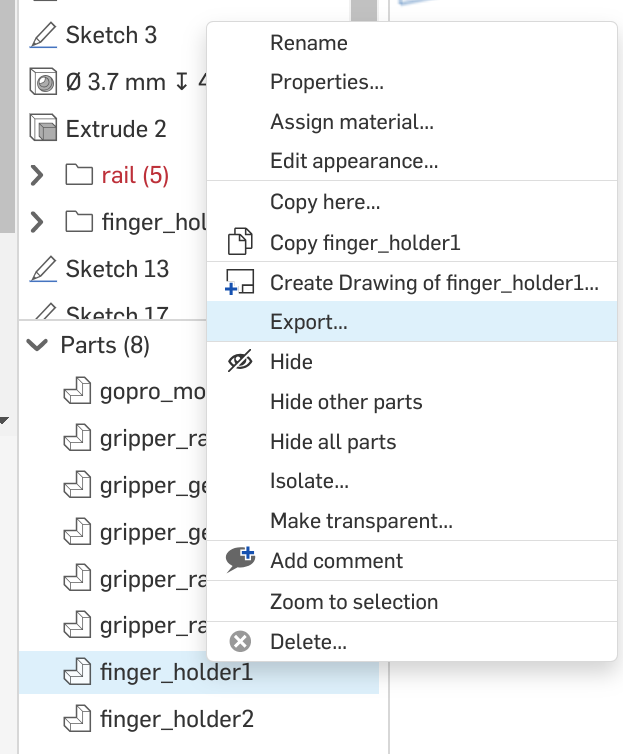
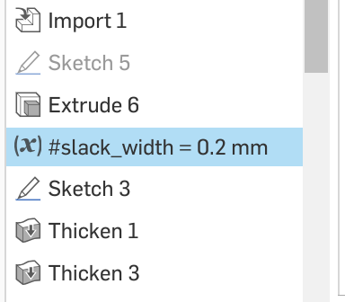

# 3D 打印说明

这份文档记录 Go2 + X5/ARX5 系统相关打印件。当前主链路最重要的是 Go2-X5 安装件；iPhone、GoPro、fin-ray gripper 打印件属于可选或历史 UMI 链路。

## 1. 打印件分类

当前必需：

- Go2-X5/ARX5 安装板。

按需使用：

- iPhone mount base。
- iPhone 15 Pro case。

历史 UMI 外设：

- Fin-ray gripper finger。
- Fin-ray finger holder。
- GoPro mount。

## 2. CAD 导出方式

在 Onshape 网页里：

1. 选中需要导出的部件。
2. 在左侧 `Parts` 面板确认高亮部件名称。
3. 右键高亮部件。
4. 导出为 `STL`。

参考图：

## 3. Go2-X5/ARX5 安装板

CAD：

- [Go2-Arx5 mount](https://cad.onshape.com/documents/871e34dff99a08f156ada60c/w/69c70cd7dba620ca310bb3c1/e/4207c73e769cc874ee5dbfb5?renderMode=0&uiState=668f49212d96c14d2f959d43)

建议：

- 材料：PLA 或更高强度材料。
- 切片时让平面朝下。
- 打印后检查孔位和 Go2 导轨配合。
- 安装后确认机械臂底座方向和线缆走向。

## 4. iPhone 支架

只有使用 `--pose_estimator iphone` 时需要。

CAD：

- [Go2-iPhone mount base](https://cad.onshape.com/documents/871e34dff99a08f156ada60c/w/69c70cd7dba620ca310bb3c1/e/4207c73e769cc874ee5dbfb5)
- [iPhone 15 Pro Case 60 Degree](https://cad.onshape.com/documents/608f4646b71c1cbc692bc4ff/w/8446eec6f1c8816677522e5e/e/47dc016736c86060c41a6256)
- [iPhone 15 Pro Case 90 Degree](https://cad.onshape.com/documents/4f575e5e28e95b72fe181970/w/51d35653b27ed534f6a4fdc9/e/5ba4a1359ba1b1d4b7d5894d)

建议：

- 默认建议 60 度版本，让相机看到更多环境特征。
- 切片时加 tree support。
- 不同打印机精度会影响手机壳松紧。
- 如果过紧或过松，复制 CAD 并调整 `slack_width`。

参考图：

## 5. Fin-ray 夹爪和 GoPro mount

这些属于原 UMI 采集链路。

CAD：

- [Fin-ray gripper finger](https://cad.onshape.com/documents/df1d9ecd7ddd1fab68647ec9/w/957233b8e11f5cf8c592f75b/e/2b7aa35d19c6bcb9562f4922)
- [GoPro mount / finger holder CAD](https://cad.onshape.com/documents/df1d9ecd7ddd1fab68647ec9/w/957233b8e11f5cf8c592f75b/e/c307fd00a1f4677c33022436?renderMode=0&uiState=668eecc9c7235b22094fc1fc)

建议：

- Fin-ray finger：TPU。
- GoPro mount：PA6-CF 或其他高强度材料，使用 regular support。
- Finger holder：PLA，建议 tree support。
- 这些部件不影响当前 leg12 行走策略调试。

## 6. 打印后检查

安装前检查：

- 孔位是否对齐。
- 螺丝是否能完整锁紧。
- 打印件是否有裂纹、翘边或分层。
- 安装后是否会干涉 Go2 外壳、机械臂关节、CAN 线和电源线。

上机前检查：

- 机械臂底座没有松动。
- 线缆固定，不会被腿或机械臂拉到。
- 打印件不会碰到 Go2 腿部运动空间。
