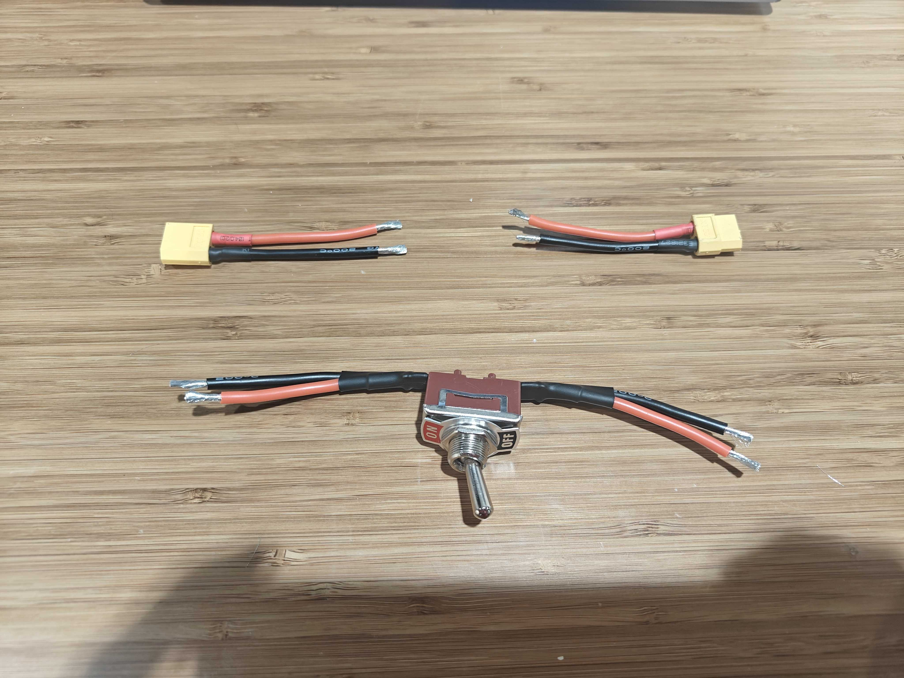
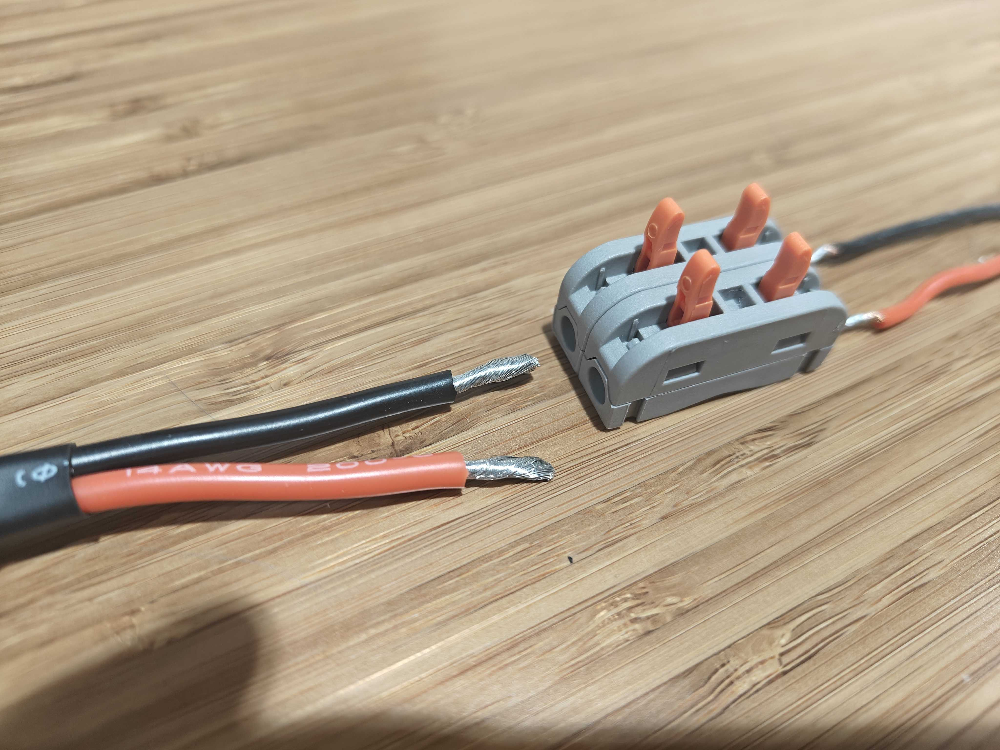
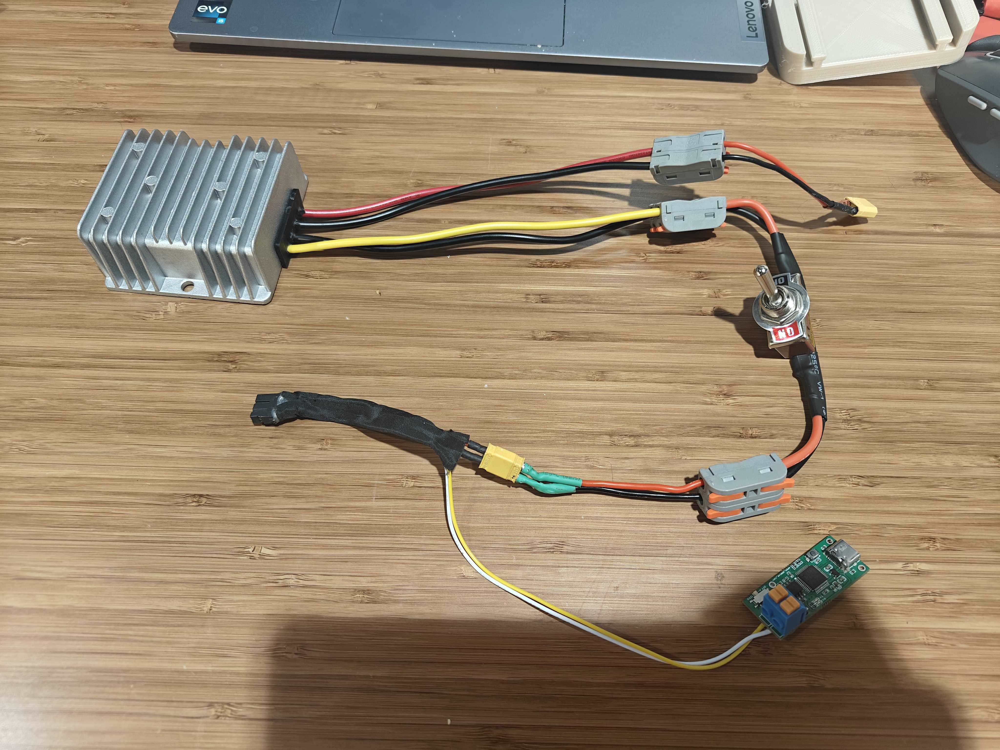

# 硬件装配说明

这份文档整理 Go2 + X5/ARX5 的硬件连接。当前 `gx-real` 主流程只要求 Go2、X5、USB-CAN 和必要网络链路可用；iPhone、GoPro、SpaceMouse 属于原 UMI 链路的可选外设。

## 1. 安全原则

装配和接线时遵守：

- 狗趴在地上或处于稳定支撑状态。
- 断开机械臂电源后再改线。
- 电源线先用独立电源测试，再接到 Go2。
- 上机时手柄 `L1` 作为第一急停手段。
- 机械臂运动空间内不要放手和线缆。

## 2. X5/ARX5 供电

原方案使用 Go2 电池侧的 `BAT/XT30` 输出给机械臂供电，但需要注意：

- Go2 满电电压可能高于 30V。
- ARX5/X5 不能直接吃超过额定范围的输入。
- 中间应通过 DC 降压模块输出稳定 24V。

推荐链路：

```text
Go2 电池/XT30 输出
  -> DC 降压模块输入
  -> DC 降压模块 24V 输出
  -> 电源开关
  -> X5/ARX5 电源输入
```

接线后先用万用表确认：

- 正负极没有接反。
- 降压输出约为 24V。
- 开关能正确断电。
- 机械臂上电后没有异常发热或异响。

原始接线参考图：

<p align="center">
  
  
  
</p>

## 3. X5/ARX5 安装到 Go2

建议流程：

1. 将 3D 打印安装板固定到机械臂底座。
2. 固定前确认机械臂底部关节方向，避免 home pose 和 Go2 前向坐标不一致。
3. 将安装板滑入 Go2 Jetson 顶部导轨。
4. 使用螺丝把安装板固定到 Go2 头部/顶部结构。
5. 连接机械臂电源线。
6. 连接 USB-CAN 到 Jetson USB 扩展坞。
7. 用 `scripts/setup_arx_can.sh` 配置 `can0`。
8. 用 ARX5 SDK 示例或当前部署程序验证电机是否在线。

注意：

- 机械臂底座方向会影响关节正方向和工作空间。
- CAN 线和电源线要固定，避免狗运动时拉扯。
- 起身和行走前确认机械臂不会撞到狗身、地面或线缆。

## 4. USB-CAN 与外设

当前主流程需要：

- USB-CAN 转接器。
- Go2 网络连接。
- 可选 USB WiFi 或 USB 网口，用于外网。

可选历史外设：

- iPhone：用于原始 VIO pose estimator。
- GoPro：用于原 UMI 数据采集。
- SpaceMouse：用于原任务空间 teleop。
- 采集卡：用于 GoPro 视频输入。

如果只跑当前 `leg12 + arm passthrough`，这些历史外设不是必需项。

## 5. iPhone 安装

iPhone 只在启用 `--pose_estimator iphone` 时需要。当前默认是：

```bash
--pose_estimator none
```

如果后续要恢复 iPhone VIO：

1. 打印 iPhone 支架和手机壳。
2. 将支架固定到 Go2 顶部导轨。
3. 使用 USB-Ethernet 或固定网络连接到 Jetson。
4. 确认 `run_pose_estimator.py` 能发布位姿。

当前真机行走调试中，不建议先引入 iPhone 变量。

## 6. GoPro 和 UMI 夹爪改装

这些内容属于原 UMI 数据采集链路。保留记录如下：

- Fin-ray finger 可以提供更大抓取范围和柔顺性。
- GoPro mount 固定在机械臂末端，用于采集第三视角/腕部视频。
- GoPro 供电可能需要独立 5V 输出或稳定 USB 电源。
- HDMI 采集卡会引入额外延迟，不适合作为低延迟控制闭环的唯一感知源。

当前 `gx-real` 行走链路不依赖 GoPro。

## 7. 装配后检查清单

上电前：

- X5 电源正负极正确。
- 降压模块输出正确。
- CAN 线固定。
- 机械臂工作空间清空。
- Go2 顶部安装件牢固。

上电后：

- `ip -details link show can0` 正常。
- `scripts/check_env.sh` 通过。
- 机械臂 SDK 不再报 `None of the motors are initialized`。
- Go2 `lowstate` 和手柄 topic 有数据。
